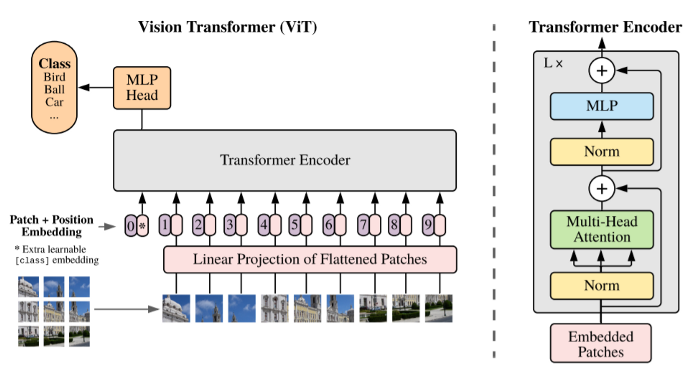

# VisionTransformer (Pytorch Implementation)
Implementation of Google's Vision Transformer proposed in "AN IMAGE IS WORTH 16X16 WORDS" using PyTorch framework.

**An image is worth 16x16 words: transformers for image recognition at scale:**
Find the original paper by Google research team[here](https://arxiv.org/pdf/2010.11929.pdf).

  

- This Pytorch Implementation is based on [This repository](https://github.com/rishavpramanik/ViT) but follows the original paper more closely in terms of the first patch embedding and initializations. The default dataset used here is CIFAR10 which can be easily changed to ImageNet or anything else.
- Einops might be required to installed manually
- According to the paper, if you are training from scratch, accuracy might not match state of the art CNNs like ResNet. Pretrain on a larger dataset to exploit the full potential of Vision transformer.
- Easy to understand commnets are available in the code for better understanding, specially for beginners in attention and transformer models.
- The standalone script "Google_ViT" is sufficient to run this code.
- Please do not forget to check loss values and optimizer.
